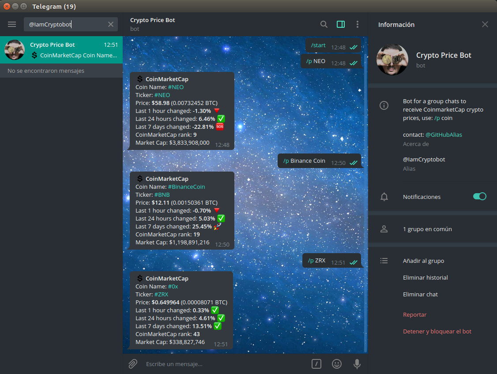

# PriceBot

[@IamCryptobot](https://t.me/IamCryptobot "@IamCryptobot") - enjoy it!

This is a light version of a [CryptoCoinsInfoBot v2 Telegram Bot](https://github.com/lytves/crypto-coins-info-bot-v2 "CryptoCoinsInfoBot v2 Telegram Bot"), it should been used in group chats to receive prices of the coins from CoinMarketCap.

Had been used [python-telegram-bot library](https://github.com/python-telegram-bot/python-telegram-bot "python-telegram-bot library Library GitHub Repository"), you can use *start_polling* or *webhook* updates methods for recieve the messages (see pricebot.py code)

For use unicode emojis must be installed [Emoji Library](https://github.com/carpedm20/emoji "Emoji for Python.")

API of [CoinMarketCap](https://coinmarketcap.com/api/ "CoinMarketCap") is used

**UPD 23/01/2019:** It was been implemented CoinMarketCap professional API, which provides quite restricted paid plans, 
so the bot makes only 1 request/update CMC data per hour (to can be worked inside free BASIC plan), if you bought paid plan you should 
change config variable *config.TIME_INTERVAL* to get updated your data more often.

---

#### Use:

To get actual price of a crypto coin send a command "/p coin", you can send a coin name and also a coin ticker. For get global market cap info send the command "/cap" e.g.:

> /p VeChain
> 
> /p OMG
> 
> /p neo
>
> /cap

---

Screenshot of the working bot:

